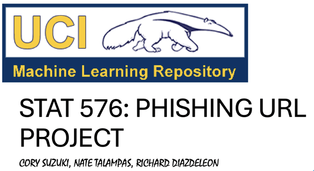

# STAT-576 Phishing Final Project

## Table of Contents
- [Introduction](#Introduction)
- [About the Data](#About-The-Data)
- [Methodology](#Methods)
  - [Data Preprocessing](#Data-Preprocessing)
  - [Feature Selection](#Feature-Selection)
  - [Clustering](#Clustering)
- [Future Work](#Future-Work)

# Introduction
In today's digital age, phishing attacks have become a major threat to individuals and organizations alike. These attacks exploit users' trust, resulting in significant financial losses and breaches of sensitive information. To address this widespread issue, it is crucial to develop effective methods for identifying and mitigating phishing attempts.

# About-The-Data

The Phishing URL Dataset consists of URLs labeled as either phishing or legitimate. Phishing URLs are designed to deceive users into providing sensitive information, such as usernames and passwords, often mimicking legitimate sites. Data can be found at the following link: https://archive.ics.uci.edu/dataset/967/phiusiil+phishing+url+dataset

# Methods
- ISOMAP
- LOCALLY LINEAR EMBEDDING (LLE)
- T-STOCHASTIC NEIGHBOR EMBEDDING (T-SNE)
- DBSCAN
  
# Data-Preprocessing
The data was retrieved directly from the UCI ML Repository using the Python code below. Data Preprocessing included one-hot encoding binary features, label encoding the target feature, standardizing the data, removing any duplicates or missing values, checking for target feature class balances, and ensuring all features are either numerical or categorical.

# Feature-Selection
The data was then modified by using feature selection to remove any redundant features and information. The algorithm of choice was feature selection by correlation since many features were too highly correlated with each other according to the EDA performed in our work. Our threshold choice was 0.85 in order to eliminate any features that had correlations too close to 1.00. This step was necessary to preserve the latent information from the remaining features in the data. We implemented the above linear and nonlinear dimensionality reduction techniques/manifold learning algorithms to extract the most important preserved dimensions. Due to our investigations, we concluded that t-SNE in the second and third dimensions produced promising results as it best captured the nonlinear nature of the data.

# Clustering
An assortment of clustering methods were employed to dynamically classify the data into two classes, with 1=phishing url and 0=not phishing url. Out of the above methods, K-Means and MiniBatch K-Means provided the most promising Adjusted Rand Index (ARI) accuracy. 

# Future-Work
To improve this project and provide a more robust analysis of the data, we consider the following recommendations:
- Consider deep-learning methods and semi-supervised learning algorithms.
- Concatenate more current data or real-time data to analyze current trends.
- Treat the distance metric as a possible hyperparameter to tune, as this project only assumed the usage of the Euclidian metric (i.e: use Mahalanobis, Manhattan, etc.).

For further analysis and information about this project please click on the following links below
- [Documentation](https://github.com/dsrichard97/STAT-576-Phishing-Final-Project/blob/main/STAT_576_PROJECT_finaldraft.pdf)
- [Powerpoint](https://github.com/dsrichard97/STAT-576-Phishing-Final-Project/blob/main/STAT%20576%20PRESENTATION.pdf)
- [Python Code](https://github.com/dsrichard97/STAT-576-Phishing-Final-Project/blob/main/Phishing_final_project.ipynb)

Updated as of 02/15/2025 by Richard Diaz

